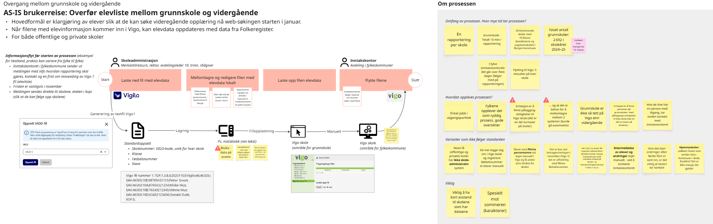

## Nåværende situasjon (AS-IS prosess): Overføring av elevliste fra grunnskole til vidergående skole

Prosessen handler om overføring av elevdata fra grunnskole til videregående skole i forbindelse med overgangen mellom skolene. Formålet med prosessen er å klargjøre elever i fylkeskommunene slik at de kan søke videregående opplæring i starten av januar. Prosessen som er skissert under, beskriver dette i detalj.

Hovedutfordringene i dagens prosess er knyttet til at den i stor grad er manuell på kommunenes side. Skoleadministrasjonen i grunnskoler må laste ned filer fra fagsystemer (f. eks. Vigilo), mellomlagre og redigere filene lokalt på PC, før redigerte filer lastes opp i fylkeskommunens fagsystem (Vigo). Prosessen er relativt enkel, men oppleves som unødvendig, da den i stor grad burde vært automatisert. I tillegg innebærer mellomlagring av filer lokalt en sikkerhetsrisiko, ettersom data kan komme på avveie fra filene som er lagret (og ikke slettet) lokalt.

