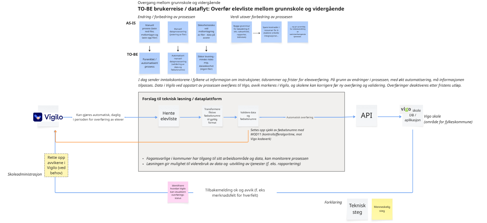
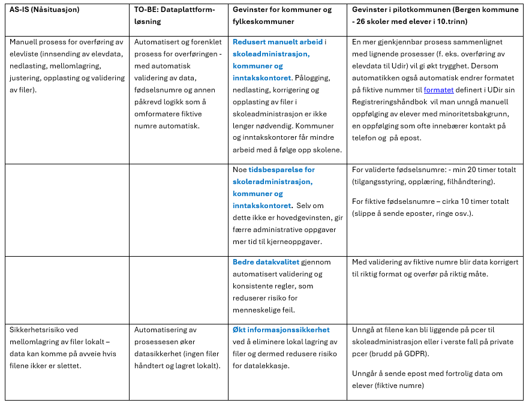
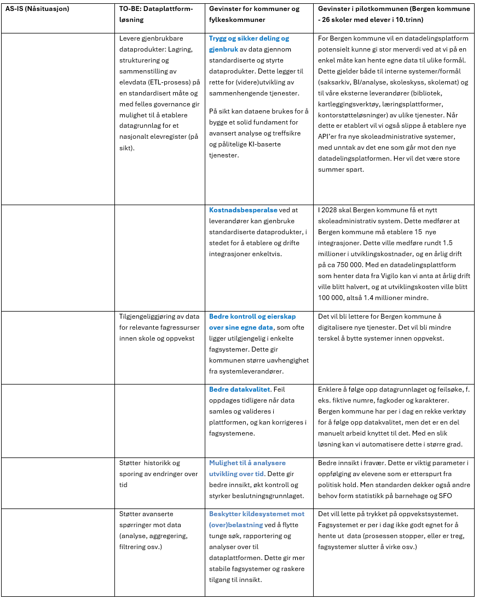

Skissen under beskriver hvordan overføring av elevlister mellom grunnskole og videregående skole er **forenklet, automatisert og sikrere** ved bruk av en dataplattform-løsning som mellomlag (KS Digital tjenesteplattform). Hovedendringen er at man går bort fra manuell filhåndtering og over til **datadrevet og automatisert dataflyt** mellom systemene. I tillegg til det er dataplattform-løsningenen bygget på en måte som gir grunnlag for videre bruk av data (f. eks. rapportering, statistikk) og videreutvikling av sammenhengende tjenester.

**Gevinster**

Gevinstene er strukturert i to kategorier:

1. Operative gevinster – knyttet til forbedring av prosessen for overføring av elevdata
2. Strategiske gevinster – knyttet til etablering og bruk av dataplattform som mellomlag

**Operative gevinster – knyttet til forbedring av prosessen for overføring av elevdata**

**Strategiske gevinster – knyttet til etablering og bruk av dataplattform som mellomlag**

