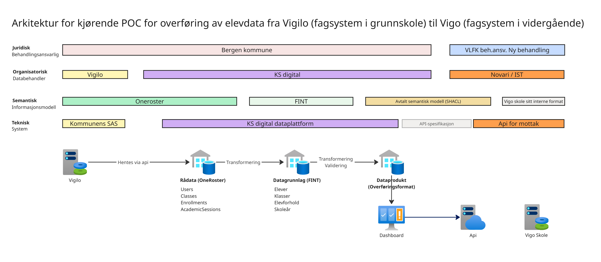

## Arkitektur for kjørende POC - overføring av elevdata fra Vigilo til Vigo

Dette dokumentet beskriver faktisk kjørende POC‑en for overføring av elevdata fra Vigilo (fagsystem i grunnskole) til Vigo (fagsystem i videregående), utført i første SAMT-BU prosjektpilot.

Beskrivelsen gjelder **implementert POC per dags dato** og skal ikke forstås som målarkitektur eller fremtidig anbefalt løsning.

### **Omfang og avgrensning**

POC‑en har som formål å:

- verifisere teknisk dataflyt fra kildesystem til mottakssystem

- teste transformasjon, struktur og kvalitet på data

- etablere et konkret grunnlag for videre vurderinger

POC‑en omfatter ikke:

- full ende-til-ende-integrasjon mot mottakssystem

- funksjonell eller organisatorisk ferdigstilling

- full overføring av elevdata fra Vigilo til Vigo. Dataoverføring er avgrenset til dataelementer i første overføringen av elevdata fra Vigilo til Vigo (Vigilo 1 fil).

### **Overordnet flyt**

Den kjørende POC-en består av følgende hovedsteg:

1. Data hentes fra Vigilo via API.

2) Data lastes inn i KS Digitals dataplattform som rådata.

3. Data transformeres til strukturert datagrunnlag (informasjonsmodell FINT v4)

4) Dataprodukt, dvs. en adhoc tilpasning av dataene i datagrunnlag til overføringsformat, etableres basert på avtalt informasjonsmodell for overføring av elevdata

5. Overføringsformat sendes til mottakergrensesnitt.

Siden mottakssystem (Vigo skole) ikke er operativt i POC‑en, benyttes mock api for vigo skole (en webapp Novari har utviklet som kjøres i KS Digital sitt Azure miljø) for å simulere mottak. Dette gjør det mulig å verifisere dataflyt, struktur og kvalitet uten å blokkere POC‑arbeidet.

### **Semantikk og informasjonsmodell**

POC‑en benytter:

- Kildesystemet OneRoster 1.1., standard datamodell for elevdata (relatert til datainnhenting)

- overordnede informasjonsmodeller (FINT v4) for å bygge datamodell for datagrunnlaget i POC-en. FINT er en informasjonsmodell utviklet av Novari som gjør det mulig å utveksle data mellom fagsystemer på en leverandøruavhengig måte.

- avtalt semantisk modell (modellert i SHACL) for overføring

Eventuelle videre harmoniseringer eller utvidelser av informasjonsmodell ligger utenfor POC‑ens scope.

### **Arkitekturskisse**

Arkitekturdiagrammet viser arkitektur slik den faktisk kjører i POC‑en per publiseringsdato. Skissen beskriver arkitektur på 4 ulike nivåer:

- juridisk (dataeierskap)

- organisatorisk (databehandler)

- semantisk (informasjonsmodell)

- teknisk (dataflyt)

### **Status**

Endringer i arkitekturen vil bli dokumentert fortløpende etter hvert som POC‑en utvikler seg.
