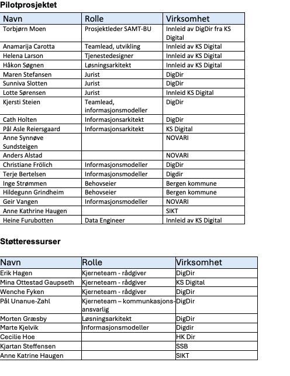
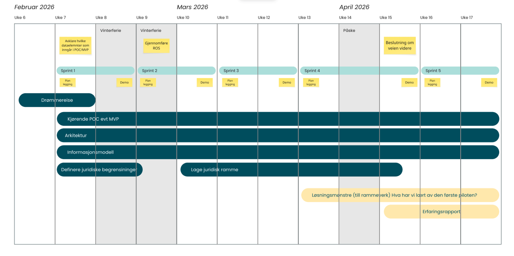

## **Carrying out pilot 1 - Seamless transition between lower and upper secondary school (as of 2 March 2026)**

## INTRODUCTION

The purpose of SAMT-BU is to establish a common foundation for collaboration and knowledge about data-driven service development and seamless user journeys across levels of government and sectors, piloted in the domain of children and young people – from kindergarten to higher education. Through practical experimentation and competence building, the project shall lay the groundwork for the common foundation to be mature and well known, so that it is used and built upon, in other domains as well.

One of the project's most central deliverables is to provide MVPs and piloting of information models and services. The project also aims to take an agile approach to its work, based on curiosity and learning through experimentation in short iterations, so that we can quickly demonstrate real value and also quickly discover what does not work (fail fast). We will do this through pilot projects covering prioritised use cases.

This document describes the plan for carrying out the first pilot. Although the pilot is described here as a phase-driven process, we assume that we will work iteratively, with individual phases repeated as needed.

## SCOPE AND DELIMITATION

### Background

Pilot 1 takes as its starting point [case 2 – Transition from primary to upper secondary](https://docs.samt-bu.no/en/behov/use-cases/02-overgang-grunnskole-vgo/).

The case concerns the transition from lower secondary to upper secondary education – one of the most important transitions in the lives of children and young people. The transition involves both a change in everyday school life and a formal transfer of responsibility from the municipality to the county authority, and it involves many actors, services and systems.

For young people, this is a phase marked by expectations, choices and increased responsibility for their own everyday life. For parents, it is about being confident that the child receives the right follow-up. For staff in schools and support services, it is about providing a good offer, often under time pressure and with limited overview.

In this transition, relevant information needs to follow the pupil in a secure, accurate and understandable way – without the pupil or parents having to act as carriers of information between actors. The case shows how current practice and systems only to a limited extent support this need.

### Objective of the pilot

The objective of the pilot is to transfer information from lower secondary to upper secondary school in a way that provides a basis for further development of seamless services. If possible, the solution shall be an MVP using live data.

### Deliverables of the pilot

The pilot has the following deliverables:

- A dream journey showing what the transition between lower and upper secondary school would be like in a perfect world.
- A running POC or MVP that moves relevant data from the municipality to the county authority.
- An information model that provides the basis for seamless, cross-sectoral services.
- Solution patterns as input to SAMT-BU's work on a framework for developing seamless services.
- Legal clarification of what the pilot can include within existing regulations, and which agreements must be entered into.
- A legal framework as a basis for SAMT-BU's work on a framework for developing seamless services.
- A lessons-learned report that provides the basis for deciding whether the pilot should continue, be transferred to others or be concluded.

Carrying out the pilot will also provide a basis for updating the project's playbook for this type of project.

Delimitation\
For now, the pilot will only look at the simplest form of transferring information from the municipality to the county authority in connection with the transition between lower and upper secondary school.

## STAFFING

## EXECUTION

Work packages of the pilot\
The following work packages have been defined:

1. Dream journey (core team)
2. Running POC or MVP
3. Information model
4. Architecture
5. Overview of the legal room for manoeuvre
6. Legal framework
7. Lessons-learned report (core team)

### Key milestones

The pilot has the following key milestones:

- When it has been clarified which information elements the pilot shall include.
- When a risk and vulnerability analysis (ROS) has been carried out for the pilot.
- When a decision has been made on the way forward for the pilot.

### Practical execution

The pilot is carried out iteratively according to agile principles, in two-week sprints. Each sprint starts with a planning meeting and ends with a demo. Initially, daily stand-ups for the whole pilot are desirable, but over time it may be sufficient to coordinate the work within each work package.

At least one retrospective should be held during the pilot period.

A dedicated GitHub solution is set up for the project and shall be used in the pilot. The pilot's tasks are followed up as issues in [samt-bu-pilot-1](https://github.com/samt-x/samt-bu-pilot-1/issues).

## Overall plan

