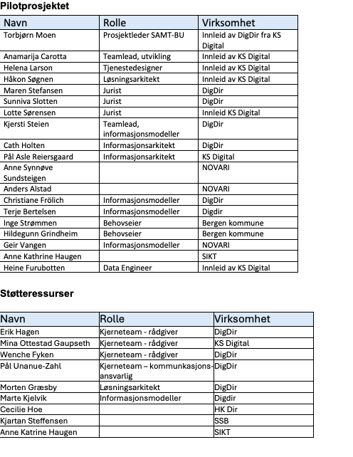
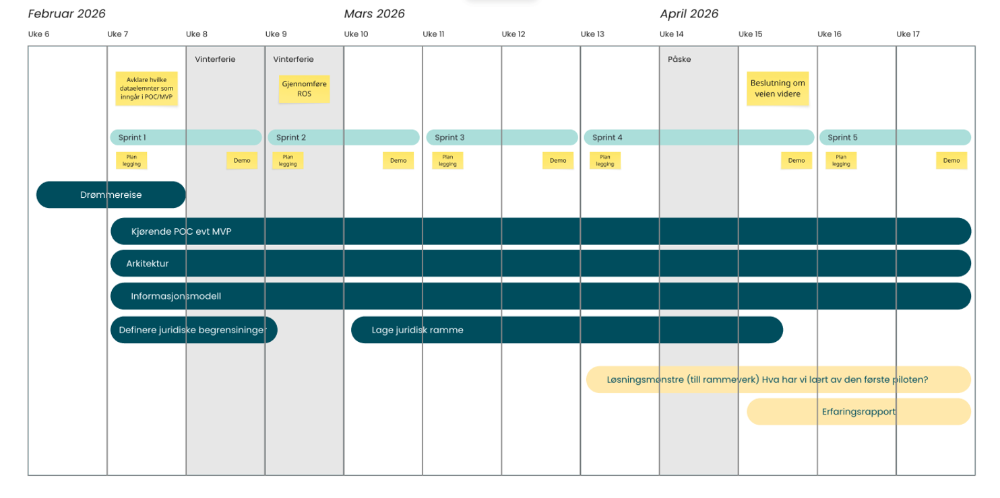

## **Gjennomføring av pilot 1 - Sømløs overgang mellom grunnskole og videregående (per 02.03.2026)**

## INNLEDNING

Formålet med SAMT-BU er å etablere et felles fundament for samarbeid og kunnskap om datadrevet tjenesteutvikling og sømløse brukerreiser på tvers av forvaltningsnivåer og sektorer, med pilotering ut fra området barn og unge – fra barnehage til høyere utdanning.  Gjennom praktisk utprøving og kompetansebygging skal prosjektet legge grunnlag for at felles fundamentet er modent og kjent, slik at det blir brukt og bygget videre på, også på andre områder.

Et av prosjektets mest sentrale produkter er å levere MVP-er og pilotering av informasjonsmodeller og tjenester. Prosjektet ønsker også å ha en smidig tilnærming til oppgavene basert på nysgjerrighet og læring gjennom utprøving i korte iterasjoner, slik at vi raskt kan vise reell verdi og også raskt finner ut hva som ikke fungerer (fail fast). Vi vil gjøre dette gjennom pilotprosjekter som dekker prioriterte use cases

Dette dokumentet inneholder en beskrivelse av plan for gjennomføring av første pilot.  Selv om vi i dette dokumentet har beskrevet gjennomføring av pilot som en fasedreven prosess, forutsettes det at vi kommer til å arbeide iterativt der enkelte faser gjentas ved behov.

## OMFANG OG AVGRENSNING

### Bakgrunn

Pilot 1 tar utgangspunkt i [case 2 – Overgang grunnskole–videregående](https://docs.samt-bu.no/behov/use-cases/02-overgang-grunnskole-vgo/).

Caset tar for seg overgangen fra ungdomsskole til videregående opplæring – en av de mest sentrale overgangene i barn og unges livsløp. Overgangen innebærer både et skifte i skolehverdag og et formelt ansvarsskifte fra kommune til fylkeskommune, og berører mange aktører, tjenester og systemer.

For ungdom er dette en fase preget av forventninger, valg og økt ansvar for egen hverdag. For foresatte handler det om trygghet for at barnet får riktig oppfølging. For ansatte i skole og støtteapparat handler det om å gi et godt tilbud, ofte under tidspress og med begrenset oversikt.

I denne overgangen er det behov for at relevant informasjon følger eleven på en trygg, presis og forståelig måte – uten at eleven eller foresatte selv må fungere som informasjonsbærer mellom aktører. Caset belyser hvordan dagens praksis og systemer i begrenset grad støtter dette behovet.

### Pilotens målsetning

Pilotens målsetning er å overføre informasjon fra grunnskole til videregående skolen på en måte som gir grunnlag for videreutvikling av sammenhengende tjenester. Om mulig skal løsningen være en MVP med skarpe data.

### Pilotens produkter

Piloten har følgende produkter:

- Drømmereise som viser hvordan overgangen mellom grunnskole og videregående skole ville være i en perfekt verden.
- Kjørende POC evt MVP som flytter relevante data fra kommunen til fylkeskommunen.
- Informasjonsmodell som danner grunnlag for sammenhengende, tverrsektorielle tjenester
- Løsningsmønstre som innspill til SAMT-BUs arbeid med rammeverk for utvikling av sammenhengende tjenester
- Juridisk avklaring på hva piloten kan inneholde innenfor eksisterende regelverk og avtaler som må inngås
- Juridisk rammeverk som grunnlag for SAMT-BUs arbeide med rammeverk for utvikling av sammenhengende tjenester
- Erfaringsrapport som danner grunnlag for avgjørelse om piloten skal fortsette, overføres til andre eller avsluttes.

Selve gjennomføringen av piloten skal også danne grunnlag for oppdatering av prosjektets «dreiebok» for gjennomføring av denne typen prosjekter.

Avgrensning\
Piloten skal i denne omgang kun se på den enkleste formen for overføring av informasjon fra kommunen til fylkeskommunen i forbindelse med overgangen mellom grunnskole og videregående skole.

## BEMANNING 

## GJENNOMFØRING

Pilotens arbeidspakker\
Det er definert følgende arbeidspakker:

1. Drømmereise (kjerneteam)
2. Kjørende POC evt MVP
3. Informasjonsmodell
4. Arkitektur
5. Oversikt over juridisk mulighetsrom
6. Juridisk rammeverk
7. Erfaringsrapport (kjerneteam)

### Viktige milepæler

Piloten har følgende viktige milepæler:

- Når det er avklart hvilke informasjonselementer piloten skal inneholde.
- Når det er gjennomført en ROS-analyse for piloten
- Når det er gjort en beslutning om veien videre for piloten

### Praktisk gjennomføring

Piloten gjennomføres iterativt etter smidige prinsipper og i sprinter på 2 uker. Hver sprint starter med et planleggingsmøte og avsluttes med en demo. I utgangspunktet er det ønskelig å gjennomføre daglige standups for hele piloten samlet, men etter hvert kan det være tilstrekkelig at arbeidet koordineres i hver av arbeidspakkene.

Det bør gjennomføres minst en retrospektiv i løpet av pilotperioden.

Det settes opp en egen GitHub-løsning for prosjektet som skal benyttes i Piloten.

## Overordnet plan

